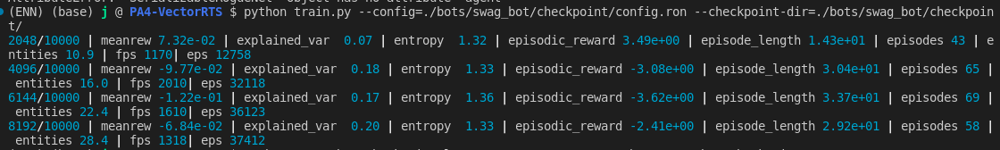

# PA4 - TensorRTS game


### Setup
```
conda create -y -n ENN python=3.8 &&
conda activate ENN &&
pip install enn_trainer torch torch_scatter colorama
```

### Note: load model
To run load_model from checkpoints successfully, you must patch `/opt/conda/envs/games38/lib/python3.8/site-packages/entity_gym/env/vec_env.py`
(Your path will be difference from mine.)

https://github.com/entity-neural-network/enn-trainer/issues/32

### Save model (checkpoints)
To generate the model, run the training this way:
```bash
python train.py --config=config.ron --checkpoint-dir=checkpoints
```

### SwagBot

Once you have an initial checkpoint in this swag_bot/checkpoint directory, you can run this:
```
python train.py --config=./bots/swag_bot/checkpoint/config.ron --checkpoint-dir=./bots/swag_bot/checkpoint/
```

After running this, move the swag_bot/checkpoint/[automatic-checkpoint-name] up into checkpoint and you can run it again.

#### Method

I simply used the basic enn with a random-ai.

I've built a new UI for the game - Though only seems to work on manual gui playthroughs.

I've coped and trained the base random ai bot and done some reworking with how the checkpoint is saved so I dont need to do as much each time to load in the renamed bot.

It now uploads to my wandb page.



