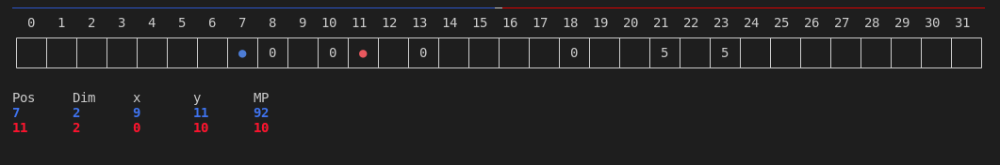

# PA4 - TensorRTS game



### Setup
```
conda create -y -n ENN python=3.8 &&
conda activate ENN &&
pip install enn_trainer torch torch_scatter colorama
```

### Note: load model
To run load_model from checkpoints successfully, you must patch `/opt/conda/envs/games38/lib/python3.8/site-packages/entity_gym/env/vec_env.py`
(Your path will be difference from mine.)

https://github.com/entity-neural-network/enn-trainer/issues/32

### Save model (checkpoints)
To generate the model, run the training this way:
```bash
python train.py --config=config.ron --checkpoint-dir=checkpoints
```
